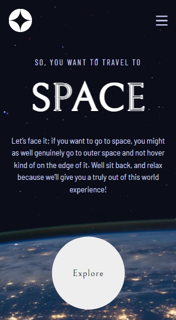
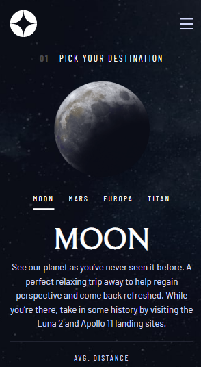
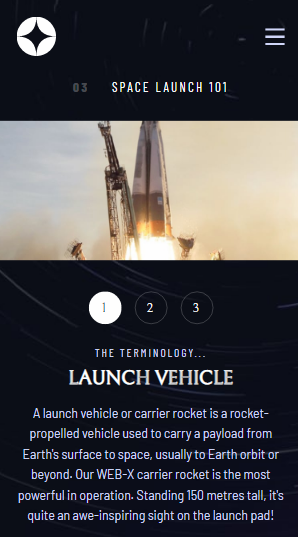

<h1 align="center">
    Space Tourism
</h1>

# ✉ About

🌟 A website where you can learn about the space! 🌟

Challenge from FrontendMentor.io

# 📎 Link to the challenge

[Link to Frontend Mentor](https://www.frontendmentor.io/challenges/space-tourism-multipage-website-gRWj1URZ3)

---

# 🌆 GIFs and images


<div display="flex">
    
    
    
</div>

# 👨‍💻👩‍💻 Use the app

You can access the application by clicking on the link below:

[Access Space Tourism](https://space-tourism-theta.vercel.app)

# 💻 Technologies used in this project

- HTML
- CSS
- JavaScript

# ❓ How to use it

```bash

git clone https://github.com/arthur-lage/space-tourism.git

cd space-tourism

cd starter-code

# Open the index.html file

```
